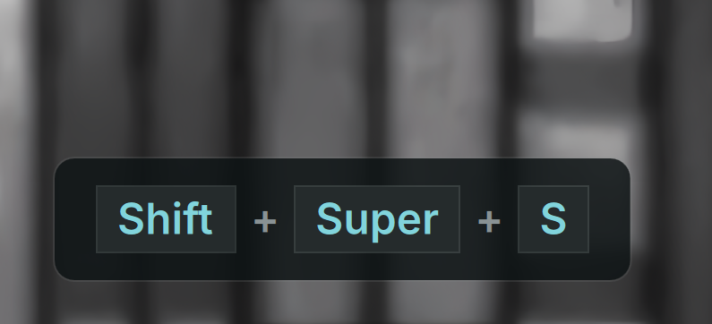

# Screenkey

An always-on-top keystroke and mouse click visualizer for DankMaterialShell (DMS), suitable for screencasts, tutorials, and presentations.



## Requirements

- `evtest` - For monitoring specific keyboard events.
- `libinput` **CLI** - For **"All Keyboards"** mode.
- **Input group** - User must be in the `input` group: `sudo usermod -aG input $USER`.

> [!NOTE]
> On many distros, the libinput CLI is in a separate package: `libinput-tools` (Arch/Debian/Ubuntu) or `libinput-utils` (Fedora). Logout and back in after adding your user to the input group.

## Installation

### Via DMS CLI
```bash
dms plugins install screenkey
```

### Manual Installation
```bash
git clone https://github.com/loccun/dms-screenkey ~/.config/DankMaterialShell/plugins/screenkey
```

## Features

- **Global Visualizer Overlay** - Displays keyboard keystrokes and mouse clicks on an always-on-top floating screen overlay.
- **Visual Keycaps** - Automatically renders shortcut key combinations (e.g. `Ctrl + Shift + A`) as individual keycaps with elegant styling.
- **Vector Mouse Click Indicators** - Highlights clicked mouse buttons (left, right, middle) inside a vector-drawn computer mouse shape alongside a compact text label.
- **Privacy First** - Defaults to hiding standard letter stream typing to protect passwords and private data, only displaying key combinations.
- **Customizable Layout** - Configure display position (bottom center, top center, bottom left, etc.), timeout duration, and font scale.

## Usage

### IPC Commands
You can control the visualizer daemon using DMS IPC:
```bash
# Toggle the visualizer on/off
dms ipc screenkey toggle

# Enable the visualizer
dms ipc screenkey enable

# Disable the visualizer
dms ipc screenkey disable
```

## License
MIT
